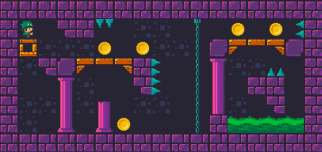
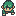
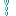
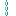

 
# So_long 
   
**[in progress]**  
Graphic project **so_long**: small 2D game with miniLibX library.  
42 School subject: [**subject.pdf**](https://cdn.intra.42.fr/pdf/pdf/24614/en.subject.pdf) 




## Task

- [x] falling
- [ ] falling animation
- [x] climbing
- [ ] jumping
- [ ] animated coins
- [ ] ability to break some blocks
- [ ] background animation
- [ ] aka enemy
- [ ] status bar
- [ ] menu
- [ ] maps

## Install & run

```
git clone https://github.com/atorys/So_long.git
```
```
make 
```
```
./so_long [map_name].ber
```
  
  
  
## Make your own map: [name].ber:
 Use these characters to put blocks


<table>
 <tr><td> P </td><td></td><td></td><td> 1 </td><td></td><td></td><td> U </td><td></td><td></td><td> 2 </td><td></td><td></td><td> ^ </td><td><td></td><td> T </td><td></td></tr>
 
 <tr><td> C </td><td></td><td>  </td><td> # </td><td></td><td>  </td><td> M </td><td><td></td><td> 3 </td><td></td></td><td></td><td> > </td><td></td><td></td><td> | </td><td></td></tr>
 
 <tr><td> E </td><td></td><td>  </td><td> 0 </td><td> </td><td>  </td><td> H </td><td></td><td></td><td> 4 </td><td></td><td></td><td> < </td><td></td></tr>
 
 <tr><td> G </td><td> </td><td>  </td><td> 8 </td><td> </td><td>  </td><td> D </td><td></td><td></td><td> 5 </td><td></td><td></td><td> V </td><td></td></tr>
 
 <tr><td> L </td><td> </td><td>  </td><td>  *</td><td> </td><td></td><td></td><td></td><td></td><td> 6 </td><td></td></tr>
</table>


##  Sources
#### Code sources
  - **get_frame_and_set_size.c**  function for setting new xpm image size made by [**@lignigno**](https://github.com/lignigno)  
  - minilibx library from [**42.docs**](https://harm-smits.github.io/42docs/libs/minilibx.html)
#### Textures
  - background tileset [Dungeon Platformer Tileset](https://rottingpixels.itch.io/platformer-dungeon-tileset)
___

[](https://forthebadge.com)
